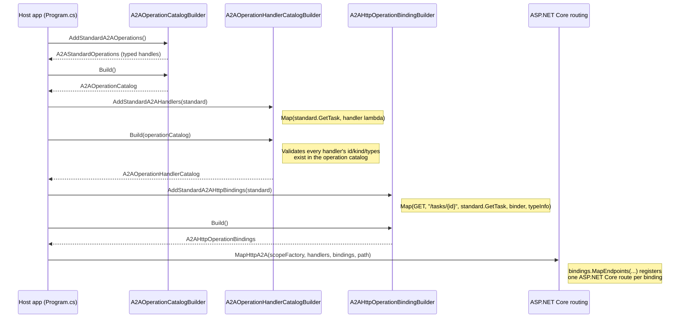
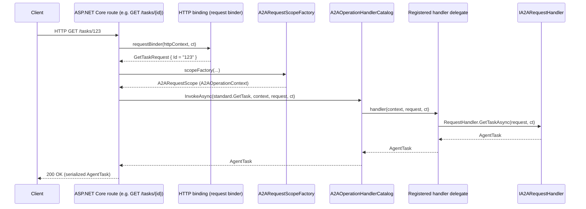
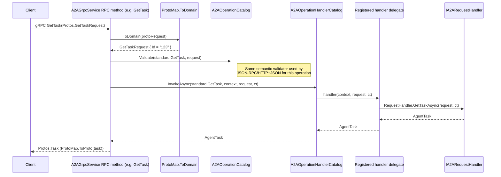
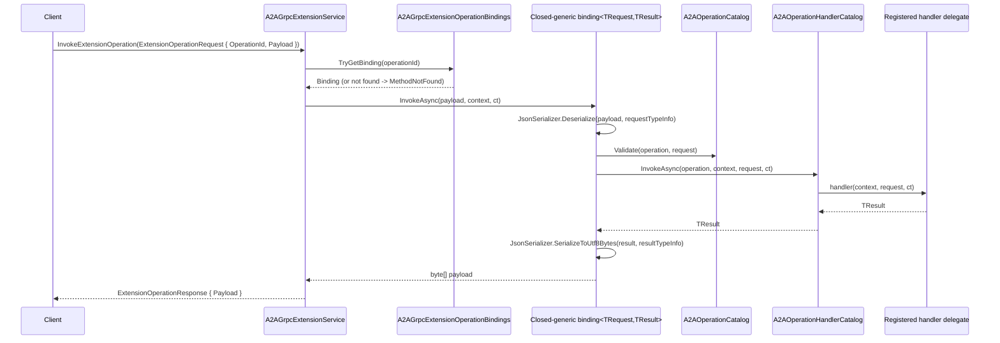
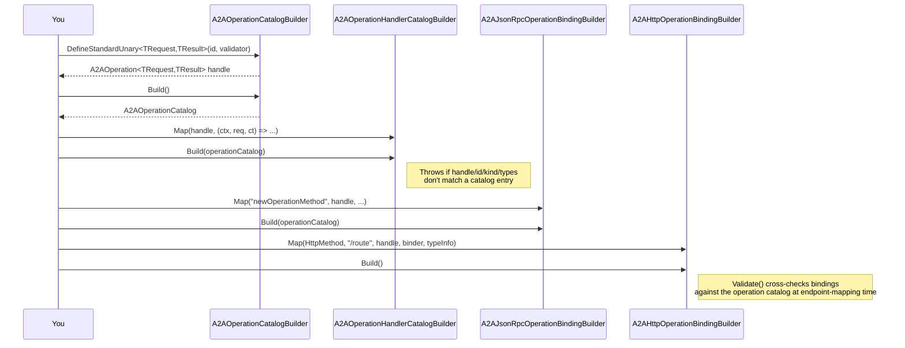

# Developer Guide: Adding and Modifying A2A Operations

This guide explains the "operations catalog" architecture used by the A2A
.NET SDK and walks through the concrete steps required to add a new
operation, or modify an existing one. It is intended for engineers (human or
AI) who are not yet familiar with this part of the codebase.

## Why an operations catalog?

A2A exposes the same logical operations (`send-message`, `get-task`, etc.)
over multiple transports: JSON-RPC, HTTP+JSON REST, and gRPC. Rather than
duplicating request validation, dispatch, and error handling per transport,
the SDK defines each operation **once**, in a transport-neutral way, and then
separately **binds** that definition to each transport.

> **Note on gRPC:** the `A2A.Grpc`/`A2A.Grpc.AspNetCore` packages have a
> fixed, code-generated contract (from the vendored `.proto`), so there is no
> `A2AJsonRpcOperationBindings`/`A2AHttpOperationBindings`-style dynamic
> transport binding for *standard* operations — each RPC method in
> `A2AGrpcService` is wired to its standard operation explicitly. However,
> `A2AGrpcService` **does** dispatch through the same operation catalog and
> handler catalog as JSON-RPC/HTTP+JSON: each RPC method maps the incoming
> proto message to the operation's domain request type, validates it with
> the operation catalog's semantic validator
> (`A2AOperationCatalog.Validate`/`ValidateStreaming`), and invokes the
> shared `A2AOperationHandlerCatalog`. This means all three transports
> enforce identical validation and dispatch behavior for standard operations
> — see `src/A2A.Grpc.AspNetCore/A2AGrpcService.cs`. Custom/extension
> operations registered only via the operation catalog *are* reachable over
> gRPC too, through a generic envelope service
> (`A2AGrpcExtensionService`/`A2AExtensionService`) that dispatches by
> operation id with JSON-encoded payload bytes rather than a per-operation
> RPC — see [gRPC dispatch (custom/extension operations)](#grpc-dispatch-customextension-operations)
> below.

This separation is implemented with three cooperating catalogs:

| Catalog | Type | Purpose |
|---|---|---|
| Operation catalog | `A2AOperationCatalog` (built by `A2AOperationCatalogBuilder`) | Declares *what* an operation is: its id, request/result types, unary vs. streaming, semantic validator, and declared errors. |
| Handler catalog | `A2AOperationHandlerCatalog` (built by `A2AOperationHandlerCatalogBuilder`) | Maps each declared operation to the code that actually executes it (typically delegating to `IA2ARequestHandler`). |
| Transport bindings | `A2AJsonRpcOperationBindings` / `A2AHttpOperationBindings` (built by `A2AJsonRpcOperationBindingBuilder` / `A2AHttpOperationBindingBuilder`) | Maps each operation to a JSON-RPC method name or an HTTP route + verb, including request binding/deserialization and response serialization. |

Key source files:

- `src/A2A/Operations/A2AOperationCatalog.cs` — operation definitions
  (`A2AOperationCatalogBuilder`, `A2AOperationCatalog`, `A2AOperation<,>`,
  `A2AStreamingOperation<,>`).
- `src/A2A/Operations/A2AOperationHandlerCatalog.cs` — handler registration
  and invocation (`A2AOperationHandlerCatalogBuilder`,
  `A2AOperationHandlerCatalog`).
- `src/A2A/Operations/A2AStandardOperations.cs` — the built-in operation
  *definitions* (`A2AStandardOperations`,
  `AddStandardA2AOperations`).
- `src/A2A/Operations/A2AStandardOperationHandlers.cs` — the built-in
  operation *handlers* (`AddStandardA2AHandlers`), which forward to
  `IA2ARequestHandler`.
- `src/A2A.AspNetCore/A2AJsonRpcOperationBindings.cs` +
  `A2AStandardJsonRpcBindings.cs` — JSON-RPC method bindings.
- `src/A2A.AspNetCore/A2AHttpOperationBindings.cs` +
  `A2AStandardHttpBindings.cs` — HTTP+JSON route bindings.
- `src/A2A.AspNetCore/A2AEndpointRouteBuilderExtensions.cs` — wires the
  catalogs together and maps ASP.NET Core endpoints (`MapA2A`,
  `MapHttpA2A`).
- `src/A2A.Grpc.AspNetCore/A2AGrpcService.cs` — builds the same standard
  operation/handler catalogs and dispatches each RPC method through them,
  giving gRPC parity with the JSON-RPC/HTTP+JSON bindings for standard
  operations.

## The pieces of an operation

Every operation is identified by a transport-neutral `A2AOperationId`
(a URI-like string, e.g. `https://a2a-protocol.org/operations/get-task`) and
is one of two kinds:

- **Unary** (`A2AOperation<TRequest, TResult>`) — one request, one result.
- **Streaming** (`A2AStreamingOperation<TRequest, TEvent>`) — one request,
  a stream of events (`IAsyncEnumerable<TEvent>`).

Both are opaque, reference-equality-checked *handles* returned by the
operation catalog builder. The handle is what you pass around — to
register a handler, to bind a transport route, or to declare an error — so
the catalogs can validate that everything is wired to the same logically
registered operation.

## End-to-end flow (standard operations)

The diagram below shows how a standard operation (e.g. `get-task`) is
assembled at startup and then dispatched at request time over HTTP+JSON.
JSON-RPC follows the same shape with `A2AJsonRpcOperationBindings` instead
of `A2AHttpOperationBindings`.



At request time:



### gRPC dispatch (standard operations)

`A2AGrpcService` builds its own instance of the standard operation and
handler catalogs (via the same `AddStandardA2AOperations`/
`AddStandardA2AHandlers` calls, cached once per process in a
`Lazy<(...)>`), then each RPC method validates and dispatches through them
instead of calling `IA2ARequestHandler` directly:



Because `A2AOperationCatalog.Validate`/`ValidateStreaming` and
`A2AOperationHandlerCatalog.InvokeAsync`/`InvokeStreamingAsync` are shared
with the JSON-RPC/HTTP+JSON bindings, a gRPC client gets exactly the same
validation errors (mapped to `RpcException` via `GrpcErrorMapping`) as an
HTTP client for the same bad input — there is no separate gRPC-only
validation path to keep in sync.

### gRPC dispatch (custom/extension operations)

Standard operations get a dedicated RPC method per operation because the
vendored `.proto` is a fixed, hand-curated contract. Custom/extension
operations — ones registered only via `A2AOperationCatalogBuilder.DefineUnary`/
`DefineStreaming` and never added to `A2AStandardOperations` — don't get
their own RPC. Instead, `A2A.Grpc`/`A2A.Grpc.AspNetCore` expose a second,
generic **envelope** service, defined in
`src/A2A.Grpc/Protos/a2a-extensions.proto`:

- `A2AExtensionService.InvokeExtensionOperation` — unary envelope RPC.
- `A2AExtensionService.InvokeStreamingExtensionOperation` — server-streaming
  envelope RPC.

Both RPCs take an `ExtensionOperationRequest` containing the operation's
`A2AOperationId` (as a string) plus a JSON-encoded `bytes` payload, and
return `ExtensionOperationResponse`/`ExtensionOperationEvent` messages that
wrap the result/event the same way. There is no per-operation message type
to add to the proto, which is what makes the envelope usable for
operations an extension author defines without touching this repo's
vendored contract.

Wiring an extension operation into the envelope is a transport binding,
exactly like a JSON-RPC or HTTP+JSON binding, using
`A2AGrpcExtensionOperationBindingBuilder`
(`src/A2A.Grpc.AspNetCore/A2AGrpcExtensionOperationBindings.cs`):

```csharp
var bindings = new A2AGrpcExtensionOperationBindingBuilder()
    .Map(myExtension.ResumeAuth, MyJsonContext.Default.ResumeAuthRequest, MyJsonContext.Default.ResumeAuthResult)
    .Build(operationCatalog);

services.AddA2AGrpcExtensions(handlerCatalog, bindings);
// ...
app.MapGrpcA2AExtensions();
```

`A2AGrpcExtensionService` (the RPC implementation) looks up the binding for
the incoming operation id, and — like `A2AGrpcService` — deserializes the
request, validates and invokes through the *same* operation/handler
catalogs used by every other transport:



Notes and current limitations:

- The envelope only catches `A2AException` (the standard error codes) and
  maps it to an `RpcException` via `GrpcErrorMapping.ToRpcException`, the
  same as the standard RPC methods. Declared typed errors
  (`A2AOperationError<TDetails>`/`DeclareError`) are **not** yet surfaced
  through the envelope — only the HTTP+JSON binding supports typed error
  details today.
- An unknown operation id yields `StatusCode.NotFound`
  (`A2AErrorCode.MethodNotFound`); invoking a streaming operation through
  the unary RPC (or vice versa) yields `StatusCode.InvalidArgument`
  (`A2AErrorCode.InvalidRequest`).
- `AddA2AGrpcExtensions`/`MapGrpcA2AExtensions` are independent of
  `AddA2AGrpc`/`MapGrpcA2A` — an app can host the standard gRPC service,
  the extension envelope, both, or neither.

## Adding a brand-new operation

Use this checklist when the A2A protocol (or an extension) introduces a
genuinely new operation.

1. **Define the request/result (or event) types**, if they don't already
   exist, as ordinary DTOs under `src/A2A` (following existing patterns,
   e.g. `GetTaskRequest`, `AgentTask`).

2. **Declare the operation** in `A2AStandardOperations.cs` (for protocol
   standard operations) or in your own extension class (for custom/
   non-standard operations):
   - Add a field/property of type `A2AOperation<TRequest, TResult>` or
     `A2AStreamingOperation<TRequest, TEvent>` to the holder type
     (`A2AStandardOperations` or your own).
   - In the builder extension method, call
     `builder.DefineStandardUnary<TRequest, TResult>(new A2AOperationId("..."), validator)`
     (standard operations) or `builder.DefineUnary<TRequest, TResult>(...)`
     / `DefineStreaming<...>(...)` (extension operations), passing an
     optional `A2AOperationValidator<TRequest>` for semantic validation.
   - Operation ids are stable strings; for standard operations they follow
     the `https://a2a-protocol.org/operations/<kebab-case-name>` pattern.

3. **Register a handler** in `A2AStandardOperationHandlers.cs` (or your own
   handler-registration extension):
   - Call `builder.Map(standard.NewOperation, handlerLambda)` for unary, or
     `builder.MapStreaming(standard.NewOperation, handlerLambda)` for
     streaming.
   - The handler lambda receives `(A2AOperationContext context, TRequest
     request, CancellationToken cancellationToken)` and typically forwards
     to `context.RequestHandler` (an `IA2ARequestHandler`). If the protocol
     surface itself is changing, add the corresponding method to
     `IA2ARequestHandler` first.

4. **Bind the operation to each transport you need to support:**
   - **JSON-RPC** — in `A2AStandardJsonRpcBindings.cs`, add a
     `.Map(...)`/`.MapStreaming(...)` call to
     `AddStandardA2AJsonRpcBindings`, giving the JSON-RPC method name.
   - **HTTP+JSON** — in `A2AStandardHttpBindings.cs`, add a
     `.Map(...)`/`.MapStreaming(...)` call to `AddStandardA2AHttpBindings`,
     giving the HTTP method, route template, a request binder
     (`HttpContext -> TRequest`), and the result's `JsonTypeInfo<TResult>`
     from `A2AJsonUtilities.DefaultOptions`. Also add the route to
     `CanonicalRouteOperationIds` so the reserved-route validation stays in
     sync.

5. **Declare known errors**, if applicable, with
   `operationCatalogBuilder.DeclareError<TRequest, TResult, TDetails>(operation, errorId)`,
   then map each declared error to an HTTP status via
   `httpBindingBuilder.MapError(operation, error, statusCode, detailsTypeInfo)`.

6. **Add tests** mirroring the existing suites in
   `tests/A2A.UnitTests/Operations/` and
   `tests/A2A.UnitTests/AspNetCore/`:
   - Catalog/handler tests: operation is discoverable, handler invokes the
     right `IA2ARequestHandler` method, validator rejects bad input.
   - Transport tests: JSON-RPC method dispatch, HTTP route dispatch
     (success + error paths), serialization round-trip.

7. **Update the agent card / spec references** if the new operation affects
   capability negotiation or public documentation.

> **gRPC parity:** if the new operation adds a method to `IA2ARequestHandler`
> itself (i.e. it's a core protocol operation, not a custom/extension
> operation), also add the matching RPC to the vendored `.proto`, regenerate
> the gRPC contract, add the operation to `A2AStandardOperations`/
> `AddStandardA2AOperations` as described above, and implement the RPC
> method in `A2AGrpcService` (`src/A2A.Grpc.AspNetCore/A2AGrpcService.cs`)
> so it maps the proto request to the domain request type and dispatches
> through `_handlers`/`_standard` (the shared operation and handler
> catalogs) exactly like the other standard RPC methods — otherwise the
> gRPC binding silently falls behind JSON-RPC/HTTP+JSON, or dispatches
> without the catalog's shared validation. Custom/extension operations
> don't need a new RPC or regenerated contract at all: register them with
> the generic envelope service instead (`A2AGrpcExtensionOperationBindingBuilder`
> — see [gRPC dispatch (custom/extension operations)](#grpc-dispatch-customextension-operations)).

### Sequence: wiring a new operation at startup



## Modifying an existing operation

Changing an existing operation is riskier because it can break wire
compatibility. Before changing a request/result shape, confirm whether the
change is additive (new optional field) or breaking (removed/renamed
field, changed semantics, changed route).

Typical steps:

1. **Update the DTO** (`TRequest`/`TResult`/`TEvent`) — prefer additive,
   backward-compatible changes (new optional properties with sensible
   defaults). Mirror any JSON property renames/aliases needed for
   compatibility.
2. **Update the validator**, if semantic validation rules changed
   (`A2AOperationValidator<TRequest>` passed to `DefineStandardUnary`/
   `DefineStandardStreaming`).
3. **Update the handler** in `A2AStandardOperationHandlers.cs` if the
   mapping to `IA2ARequestHandler` changed.
4. **Update transport bindings**:
   - If the route/method name must change, remember routes are
     validated against `CanonicalRouteOperationIds` — update that table
     too, or the reserved-route check will throw.
   - If request binding logic changed (e.g., a new query parameter), update
     the binder function in `A2AStandardHttpBindings.cs` /
     `A2AStandardJsonRpcBindings.cs`.
5. **Do not change `A2AOperationId` casually** — it is the stable identity
   used to match operation definitions, handlers, and bindings together.
   Changing it is equivalent to introducing a new operation and removing
   the old one.
6. **Update/extend tests** for every layer touched (catalog, handler,
   JSON-RPC binding, HTTP binding) and verify round-trip JSON compatibility
   with any existing captured payloads.
7. **Run the full test suite** for the affected projects:
   ```powershell
   dotnet test tests/A2A.UnitTests/A2A.UnitTests.csproj
   ```

## Validation safety nets

The catalogs intentionally fail fast at *build* time (during app startup),
not at request time, so misconfigurations are caught immediately:

- `A2AOperationHandlerCatalogBuilder.Build(operationCatalog)` throws if a
  registered handler's id/kind/request-type/result-type doesn't match an
  entry in the supplied `A2AOperationCatalog`, or if the handle doesn't
  belong to that catalog.
- `A2AHttpOperationBindings.Validate(handlerCatalog.OperationCatalog)` /
  the JSON-RPC equivalent cross-check that every bound operation exists in
  the catalog before `MapA2A`/`MapHttpA2A` registers routes.
- `A2AStandardHttpBindingBuilderExtensions.ValidateReservedRouteBinding`
  prevents a custom binding from hijacking a canonical standard route
  (e.g. you cannot remap `GET /tasks/{id}` to a non-standard operation).

If you see one of these exceptions while wiring up a new or modified
operation, it means a mismatch between the operation catalog, handler
catalog, or transport bindings — re-check that you're passing the exact
same typed handle (`standard.X`) to every builder.

## Quick reference: where to add code for a new standard operation

| Step | File |
|---|---|
| Request/result DTOs | `src/A2A/*.cs` (new or existing models) |
| Operation definition | `src/A2A/Operations/A2AStandardOperations.cs` |
| Handler | `src/A2A/Operations/A2AStandardOperationHandlers.cs` |
| `IA2ARequestHandler` method (if new) | `src/A2A/IA2ARequestHandler.cs` |
| JSON-RPC binding | `src/A2A.AspNetCore/A2AStandardJsonRpcBindings.cs` |
| HTTP+JSON binding | `src/A2A.AspNetCore/A2AStandardHttpBindings.cs` |
| gRPC RPC (vendored `.proto` + `.proto`-generated RPC, if new) | `src/A2A.Grpc/Protos/a2a.proto`, `src/A2A.Grpc.AspNetCore/A2AGrpcService.cs` |
| Unit tests | `tests/A2A.UnitTests/Operations/`, `tests/A2A.UnitTests/AspNetCore/`, `tests/A2A.Grpc.UnitTests/` |

## Quick reference: where to add code for a new custom/extension operation

Custom/extension operations skip the vendored `.proto` entirely — bind them
to the generic gRPC envelope instead of adding an RPC.

| Step | File |
|---|---|
| Request/result (or event) DTOs | your extension's own project |
| Operation definition | your extension's own `A2AOperationCatalogBuilder.DefineUnary`/`DefineStreaming` calls |
| Handler | your extension's own `A2AOperationHandlerCatalogBuilder.Map`/`MapStreaming` calls |
| JSON-RPC binding | `A2AJsonRpcOperationBindingBuilder.Map`/`MapStreaming` |
| HTTP+JSON binding | `A2AHttpOperationBindingBuilder.Map`/`MapStreaming` |
| gRPC binding (no proto changes) | `A2AGrpcExtensionOperationBindingBuilder.Map`/`MapStreaming` in `src/A2A.Grpc.AspNetCore/A2AGrpcExtensionOperationBindings.cs`, hosted via `AddA2AGrpcExtensions`/`MapGrpcA2AExtensions` in `src/A2A.Grpc.AspNetCore/GrpcA2ARouteBuilderExtensions.cs` |
| Unit tests | mirror `tests/A2A.Grpc.UnitTests/GrpcExtensionOperationTests.cs` |
